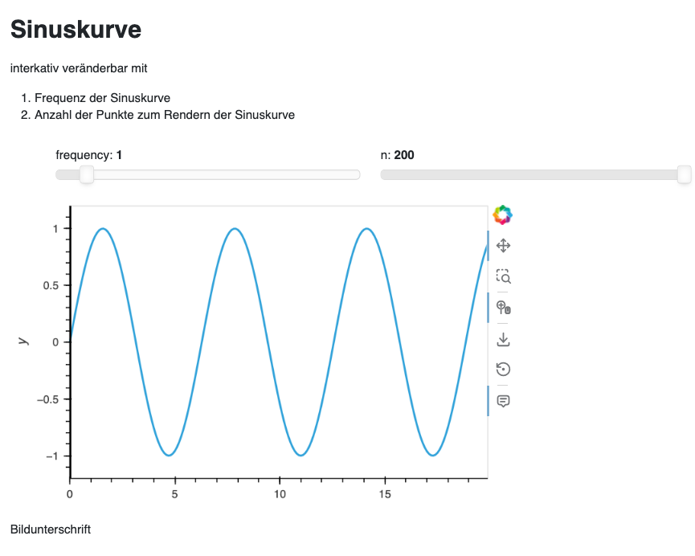

# dash-App

Die initiale Struktur der App wurde erstellt mit
```console
uv init --package dash
```

Falls `uv` bei euch noch nicht installiert ist, könnt ihr es unter Windows installieren mit

```console
> powershell -c "irm https://astral.sh/uv/install.ps1 | iex"
```

## Installation

```console
> cd dataprep
> uv sync --frozen
```

## Aktualisierung der Abhängigkeiten

```console
> cd dash
> uv sync
```

## Nutzung

1. Zunächst wird Jupyter Lab im Web-Browser geöffnet, indem im Terminal folgendes eingegeben wird:

   ```console
   > uv run jupyter lab
   ```

2. Anschließend kann das Notebook `notebooks/dashboard.ipynb` geöffnet und in *Kernel → Restart Kernel and Run All Cells…* der Bokeh-Server mit dem Panel-Dashboard gestartet werden:

   

